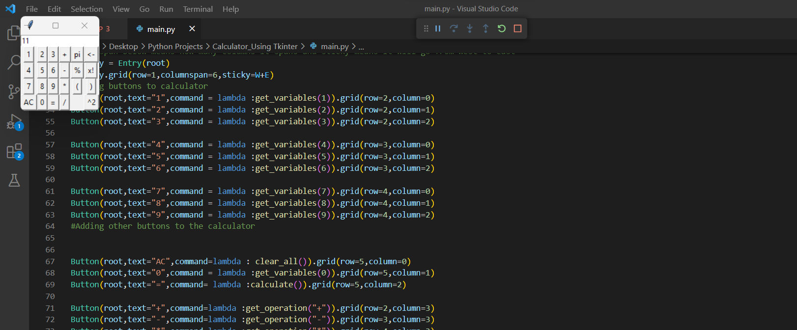

Over here, I have created a calculator using the tkinter library in python. By clicking on the buttons, the user is able to perform various arithmetic operations and to
see the result. Tkinter allows us to add buttons in rows and columns. In some places I have also added comments to understand what the below code or function does

## Libraries
* Tkinter

## Requirements
* VS Code
* Python

## Code 

* [Code](code/main.py)
